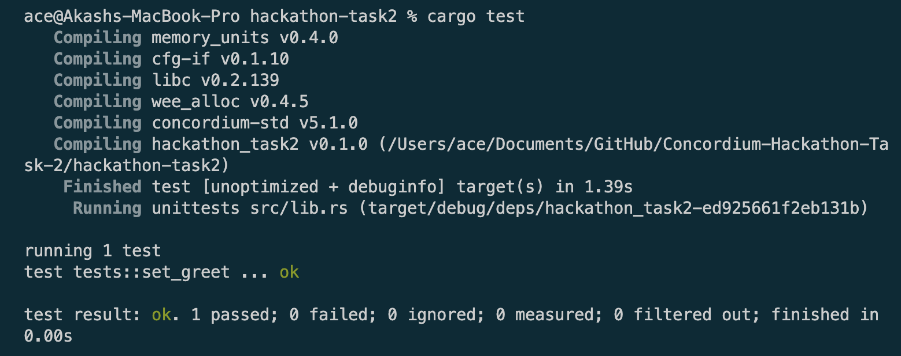
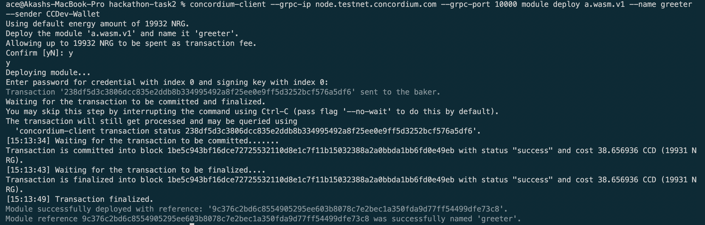
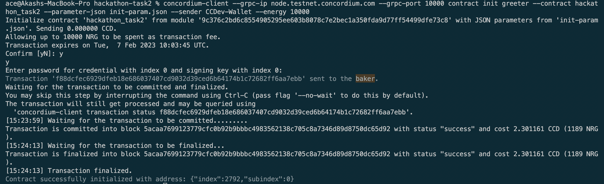
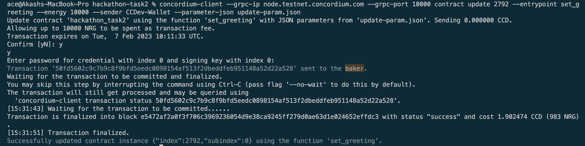

# Concordium Hackathon Task 2

### Test



### Deployment



```
238df5d3c3806dcc835e2ddb8b334995492a8f25ee0e9ff5d3252bcf576a5df6
```

### Init



```
f88dcfec6929dfeb18e686037407cd9032d39ced6b64174b1c72682ff6aa7ebb
```

param:

```
{
  "description": "Set New Greeting Here"
}

```

### Update



```
50fd5602c9c7b9c8f9bfd5eedc0898154af513f2dbeddfeb951148a52d22a528
```

param:

```
"Hello World!"
```

### Invoke


---

Mainnet Address - 3Bh56Sog9MZ2SqC6goJAjpgaud775jzzgtW8eevaPfhKzG9Mf5
